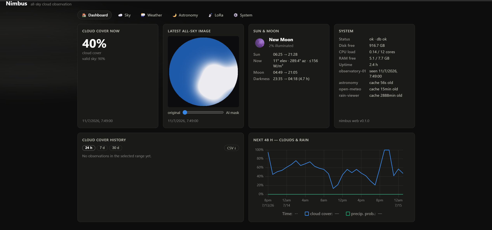
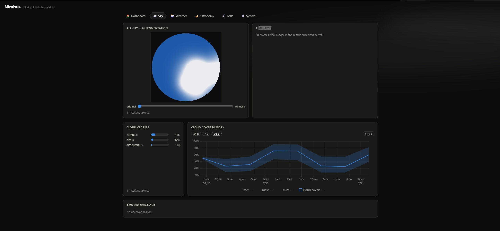
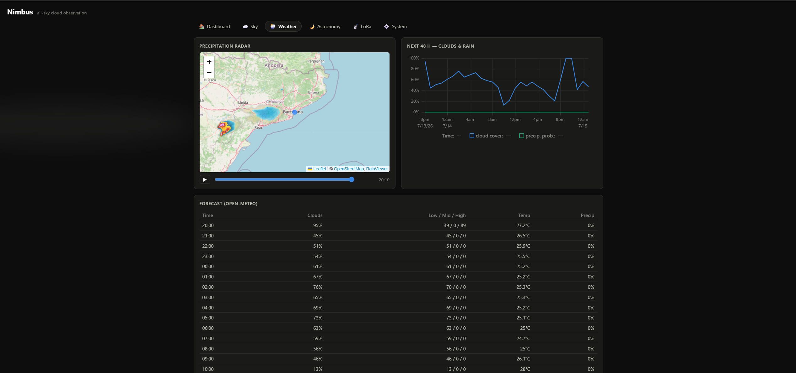
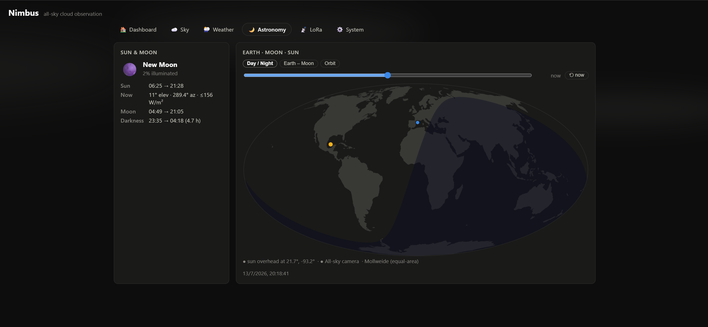
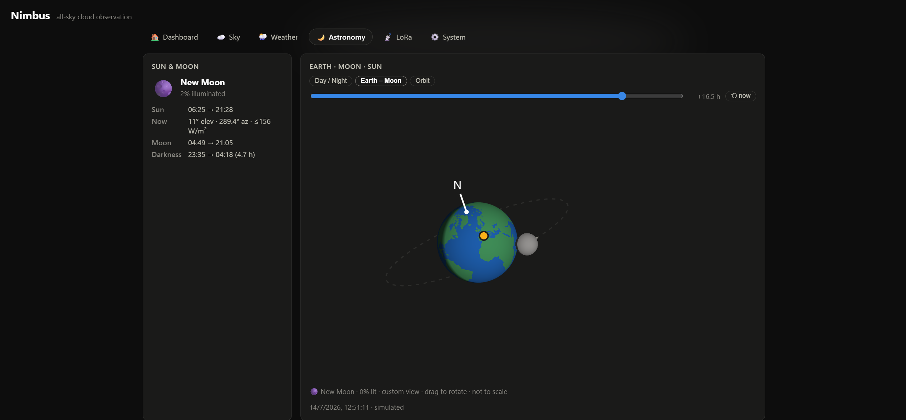
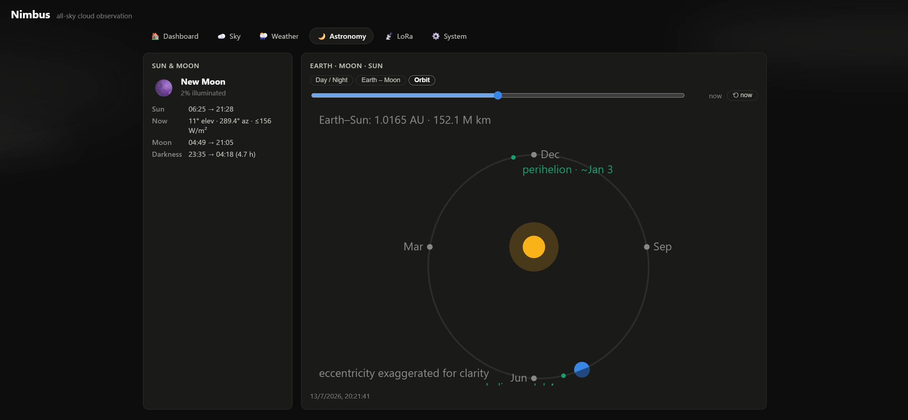
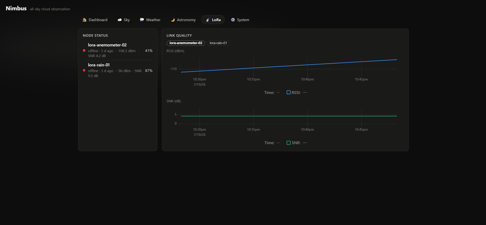
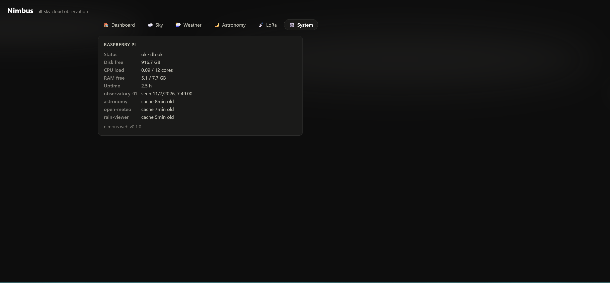

# Nimbus Web

Dashboard and REST API for the Nimbus all-sky cloud observation system.
A single FastAPI process on the Raspberry Pi 5 stores the observations and
LoRa node telemetry that `observatory/` produces, serves them to any HTTP
client (browser, phone, e-paper, scripts), and hosts a widget-based
dashboard built with Svelte. External data sources (weather agencies,
astronomy, precipitation radar, ...) plug in as cache-first *providers* so
the dashboard keeps working when the internet doesn't. An optional ambient
layer paints the page with the current weather — rain drops, drifting
clouds, sun glow, or stars.

## Screenshots

**Dashboard** — cloud cover now, latest all-sky frame with AI-mask slider,
sun/moon summary, Pi system health, 24 h history and 48 h forecast in one
overview page:



**Sky** — all-sky image + segmentation, per-class cloud breakdown, cloud
cover history (24 h/7 d/30 d) and raw observations:



**Weather** — precipitation radar (Leaflet + RainViewer) and the Open-Meteo
hourly forecast table:



**Astronomy** — the `orrery` widget's three views, all client-side math:
day/night Mollweide map, draggable 3D Earth–Moon globe, and Earth's orbit
around the Sun.

| Day / Night | Earth – Moon | Orbit |
|---|---|---|
|  |  |  |

**LoRa** — node status (online/stale/offline, battery) and RSSI/SNR link
quality history per node:



**System** — Raspberry Pi health (CPU, RAM, disk, uptime) and provider
cache ages:



```
web/
├── config.yaml               # single source of truth: server, storage, stations,
│                             #   providers, dashboard layout
├── requirements.txt          # fastapi, uvicorn, pyyaml, httpx, astral
├── scripts/                  # PID-file managed dev server control
│   ├── restart.sh            #   stop-if-running, then start (background, logged)
│   ├── stop.sh
│   └── build-and-restart.sh  #   npm run build, then restart.sh
├── server/                   # Python package — API + storage
│   ├── main.py               # create_app() factory; uvicorn entry point
│   ├── config.py             # typed dataclasses + YAML loader (validates at load)
│   ├── db.py                 # SQLite (WAL): schema, seeding, bucketed queries
│   ├── models.py             # Pydantic schemas — the v1 observation contract
│   ├── api/                  # routers under /api/v1
│   │   ├── observations.py   #   POST ingest · GET latest / series / raw
│   │   ├── stations.py       #   station metadata + last_seen
│   │   ├── nodes.py          #   LoRa node telemetry ingest + health
│   │   ├── providers.py      #   generic cache-first provider routes
│   │   ├── dashboard.py      #   widget layout from config.yaml (enabled only)
│   │   └── health.py
│   └── providers/
│       ├── base.py           # Provider ABC (the extensibility contract)
│       ├── registry.py       # explicit name -> class map + cache-first read
│       ├── open_meteo.py     # hourly cloud layers, temp, precip + current
│       ├── astronomy.py      # sun/moon ephemeris, computed locally (astral)
│       └── rain_viewer.py    # precipitation radar frame index (RainViewer)
├── frontend/                 # Svelte 5 + Vite SPA (Node at build time only)
│   └── src/
│       ├── App.svelte        # section nav (hash-routed) + widget grid
│       ├── Ambient.svelte    # weather effects layer (dashboard.ambient)
│       ├── assets/
│       │   └── land-rings.json   # Natural Earth coastlines (public domain),
│       │                         #   bundled once, used by the orrery widget
│       ├── lib/
│       │   ├── api.js        # fetch wrapper + polling
│       │   ├── format.js     # percent / time / countdown formatting
│       │   ├── ambient.js    # weather-code -> ambient effect decision
│       │   ├── astro.js      # offline sun/moon/orbit math (Meeus, low precision)
│       │   └── events.js     # yearly sky events: meteor showers (by solar
│       │                     #   longitude), equinoxes/solstices, apsides, moons
│       └── widgets/
│           ├── registry.js   # widget type -> component map
│           ├── Widget.svelte # shared card frame (title/loading/error)
│           ├── CurrentConditions.svelte   # stat tile: cloud cover now
│           ├── AllSkyImage.svelte         # latest frame + AI-mask opacity slider
│           ├── HistoryChart.svelte        # uPlot + range selector + CSV download
│           ├── ForecastChart.svelte       # uPlot: 48 h clouds + precip prob
│           ├── OpenMeteoForecast.svelte   # hourly forecast table
│           ├── Astronomy.svelte           # sun/moon, darkness window, irradiance
│           ├── LoraNodes.svelte           # node health (online/stale/offline)
│           ├── LoraLinkChart.svelte       # RSSI/SNR history per node
│           ├── RainMap.svelte             # Leaflet + RainViewer radar frames
│           ├── CloudClasses.svelte        # per-class cloud breakdown bars
│           ├── Timelapse.svelte           # replay of recent all-sky frames
│           ├── Orrery.svelte              # terminator map / Earth–Moon / orbit
│           ├── RawObservations.svelte     # raw rows table
│           └── SystemStatus.svelte        # Pi health: CPU/RAM/temp/disk/caches
├── data/                     # runtime, gitignored: nimbus.db + images/
└── tests/                    # plain unittest (repo convention)
```

## API

All JSON timestamps are ISO 8601 UTC. Nimbus cloud metrics are [0, 1]
fractions (the UI formats percentages); provider payloads keep their native
units. Interactive docs at `/docs` (OpenAPI).

| Method | Path | Purpose |
|---|---|---|
| POST | `/api/v1/observations` | Ingest one observation (upsert on station+timestamp) |
| GET | `/api/v1/observations/latest?station_id=` | Most recent observation (compact — e-paper friendly) |
| GET | `/api/v1/observations/series?start=&end=&bucket=10m` | Bucketed avg/min/max/count as aligned arrays |
| GET | `/api/v1/observations?start=&end=&limit=` | Raw rows, newest first (limit ≤ 1000) |
| GET | `/api/v1/observations/export.csv?start=&end=` | Stream a time range as CSV (unbounded, chronological) |
| GET | `/api/v1/stations` · `/stations/{id}` | Declared stations + `last_seen` |
| POST | `/api/v1/nodes/telemetry` | LoRa node telemetry (nodes auto-register on first POST) |
| GET | `/api/v1/nodes` | Latest telemetry per node |
| GET | `/api/v1/nodes/{id}/telemetry?limit=` | Telemetry history, newest first |
| GET | `/api/v1/providers` | Enabled providers, resources, cache ages |
| GET | `/api/v1/providers/{name}/{resource}` | Provider data, cache-first (e.g. `open-meteo/forecast`, `astronomy/ephemeris`, `rain-viewer/frames`) |
| GET | `/api/v1/dashboard` | Sections + widget layouts from config.yaml |
| GET | `/api/v1/health` | DB status, disk free, Pi health (CPU/RAM/temp/uptime), cache ages |
| GET | `/images/{filename}` | All-sky images/masks from `storage.images_dir` |
| GET | `/` | The built dashboard (`frontend/dist/`, when present) |

Omitting `station_id` anywhere selects the first configured station.

### Observation schema v1 (ingest)

Required: `schema_version`, `station_id`, `timestamp` (timezone-aware),
`cloud_cover`. Everything else is optional so the contract can grow while
observatory's output types are still `TODO(design)`:

```bash
curl -X POST http://localhost:8080/api/v1/observations \
  -H 'Content-Type: application/json' \
  -d '{
    "schema_version": 1,
    "station_id": "observatory-01",
    "timestamp": "2026-07-10T12:34:56Z",
    "cloud_cover": 0.62,
    "sky_fraction": 0.87,
    "classes": {"cloud": 0.62},
    "image": {"filename": "20260710T123456Z.jpg",
              "mask_filename": "20260710T123456Z_mask.png"},
    "model": {"name": "yolo26s-seg", "variant": "int8"},
    "inference_ms": 148.2
  }'
```

Re-sending the same `(station_id, timestamp)` overwrites instead of
duplicating — retries after flaky comms are safe. Image files are written by
observatory directly into `storage.images_dir`; only filenames travel in the
JSON.

### Node telemetry schema v1 (ingest)

LoRa/IoT nodes report through the same pattern (upsert on
`(node_id, timestamp)`), but unlike stations they **auto-register** on their
first POST — field sensors come and go. Only `schema_version`, `node_id` and
`timestamp` are required; `extra` carries any free-form sensor payload:

```bash
curl -X POST http://localhost:8080/api/v1/nodes/telemetry \
  -H 'Content-Type: application/json' \
  -d '{
    "schema_version": 1,
    "node_id": "lora-rain-01",
    "timestamp": "2026-07-10T12:35:00Z",
    "rssi_dbm": -96.0,
    "snr_db": 9.5,
    "battery_pct": 87,
    "extra": {"uptime_s": 86400}
  }'
```

The `lora-nodes` widget derives each node's online / stale / offline badge
from `last_seen` age (`staleSeconds` / `offlineSeconds` props).

## Adding a widget

Backend — only when a new external source is involved:
1. `server/providers/foo.py` implementing `Provider` (`name`, `resources`,
   `fetch()`); caching/stale-fallback comes free from the registry.
2. One line in `PROVIDERS` (`server/providers/registry.py`) + a block under
   `providers:` in config.yaml.

Frontend:
1. `frontend/src/widgets/Foo.svelte` (wrap it in `Widget.svelte` for the
   card frame; `lib/api.js` gives you `get()` + `poll()`).
2. One line in `WIDGETS` (`frontend/src/widgets/registry.js`).

Then add an entry under `dashboard.layout` in config.yaml:

```yaml
- { type: "foo", title: "My widget", span: 2, props: { anything: 42 } }
```

Widgets that display nimbus's own observations need no backend step at all.

Providers don't have to call a remote API — `astronomy` computes sun/moon
ephemeris locally with `astral` and still benefits from the TTL cache.

### Built-in widgets

| type | shows | needs internet |
|---|---|---|
| `current-conditions` | latest cloud cover stat tile | no |
| `allsky-image` | latest frame + AI-mask opacity slider (original ↔ AI) | no |
| `history-chart` | cloud cover avg + min/max band, 24 h/7 d/30 d ranges, CSV download | no |
| `forecast-chart` | 48 h cloud cover + precip probability | via provider |
| `open-meteo-forecast` | hourly forecast table | via provider |
| `astronomy` | sun/moon times, phase, darkness window, azimuth/elevation, clear-sky W/m² | no |
| `lora-nodes` | node health: last seen, RSSI/SNR, battery, status | no |
| `lora-link-chart` | RSSI + SNR history per node (selector) | no |
| `rain-map` | Leaflet + OSM + RainViewer radar animation | yes (tiles) |
| `cloud-classes` | per-class cloud breakdown from `classes` | no |
| `timelapse` | replay of the recent all-sky frames | no |
| `orrery` | day/night Mollweide map (per-pixel twilight shading, centred on the station's meridian), draggable per-pixel 3D Earth–Moon globe (real axial tilt, real lunar orbital position, no separate "Sun" object — only true terminator shading), and an orbit view with month ticks, the year's sky events (meteor showers at their solar-longitude peaks, equinoxes/solstices, perihelion/aphelion) pinned to the orbit plus an upcoming-events countdown panel; time sliders ±24 h / ±12 months — all client-side math | no |
| `raw-observations` | raw observation rows table | no |
| `system-status` | Pi CPU/RAM/temp/uptime, disk, DB, cache ages, last_seen | no |

## Configuration

`config.yaml` is loaded and validated at startup (`server/config.py`);
relative paths resolve against the file's directory. Top-level keys:
`server` (host/port/static_dir), `storage` (db_path/images_dir), `stations`
(declared here, seeded into the DB), `providers` (per-provider `enabled`,
`ttl_seconds`, settings), `dashboard` (title, `refresh_seconds`, `ambient`,
sections). Point the server at another file with
`NIMBUS_WEB_CONFIG=/path.yaml`.

The dashboard is organized in observatory-style **sections** (pages), each
with its own widget grid and a hash-routed nav entry (`#/sky`, `#/lora`...):

```yaml
dashboard:
  sections:
    - id: "overview"
      title: "Dashboard"
      icon: "🏠"
      layout:
        - { type: "current-conditions", title: "Cloud cover now", span: 1 }
    - id: "sky"
      title: "Sky"
      icon: "☁️"
      layout: [ ... ]
```

A bare `dashboard.layout` (no sections) still works and renders as a single
page. The same widget type can appear in several sections with different
props — instances are independent. Every layout entry accepts
`enabled: false` to hide a widget while keeping its entry and props;
`dashboard.ambient: false` turns off the full-page weather effects (they
also disappear automatically for users with `prefers-reduced-motion`).

## Development

```bash
cd web
uv venv && uv pip install -r requirements.txt

# Terminal 1 — API with autoreload
.venv/bin/uvicorn server.main:app --reload --port 8080

# Terminal 2 — SPA with HMR on :5173 (proxies /api and /images to :8080)
cd frontend && npm install && npm run dev
```

Without `frontend/dist/` the server runs API-only, which is all the tests
need.

For a quick check against the built SPA instead of the HMR dev server, use
the background-server scripts instead of the two terminals above:

```bash
scripts/restart.sh              # (re)start uvicorn in the background
scripts/build-and-restart.sh    # rebuild the frontend first, then restart
scripts/stop.sh
```

They track the process by PID file (`data/uvicorn.pid`) and log to
`data/uvicorn.log`, so re-running `restart.sh` after an edit is a single
command instead of hunting down and killing the old process by hand.

## Build & deploy (Raspberry Pi 5)

```bash
# On the dev PC (Node never runs on the Pi):
cd web/frontend && npm run build        # -> frontend/dist/

# Ship to the Pi — dist/ is gitignored, sync it explicitly:
rsync -av --exclude .venv --exclude data --exclude node_modules \
    web/ pi:/opt/nimbus/web/

# On the Pi:
cd /opt/nimbus/web && uv venv && uv pip install -r requirements.txt
```

systemd unit (`/etc/systemd/system/nimbus-web.service`):

```ini
[Unit]
Description=Nimbus web dashboard
After=network-online.target

[Service]
User=nimbus
WorkingDirectory=/opt/nimbus/web
Environment=NIMBUS_WEB_CONFIG=/opt/nimbus/web/config.yaml
ExecStart=/opt/nimbus/web/.venv/bin/uvicorn server.main:app --host 0.0.0.0 --port 8080
Restart=on-failure

[Install]
WantedBy=multi-user.target
```

One worker only: SQLite has a single writer and the process idles at
~50–70 MB RAM, comfortably beside observatory on the Pi 5.

## Tests

```bash
.venv/bin/python -m unittest discover -s tests -v
```

Covered: config validation (including the widget `enabled` filter),
ingest→query round-trips for observations and node telemetry (upsert, bucket
math, 404s, timezone rejection, latest-per-node), provider cache
TTL/refetch/stale-fallback, Open-Meteo and RainViewer payload parsing
against canned fixtures, and the astronomy ephemeris computed for a known
location. No network, no real DB — everything runs against temp dirs. Not
covered: the Svelte widgets (thin by design) and live external API calls.
